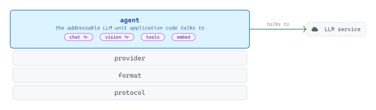
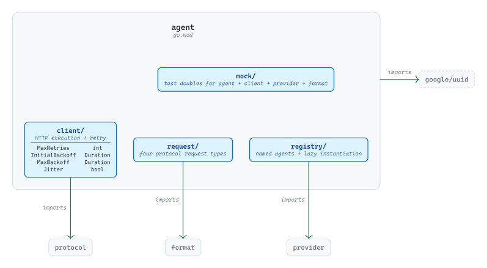
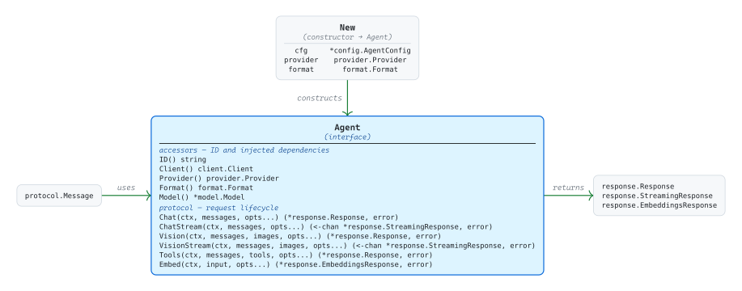
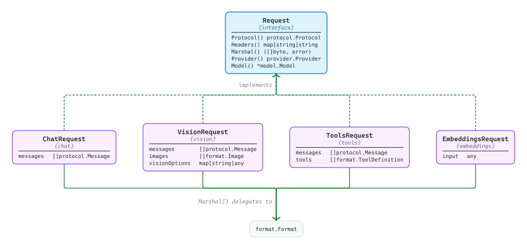
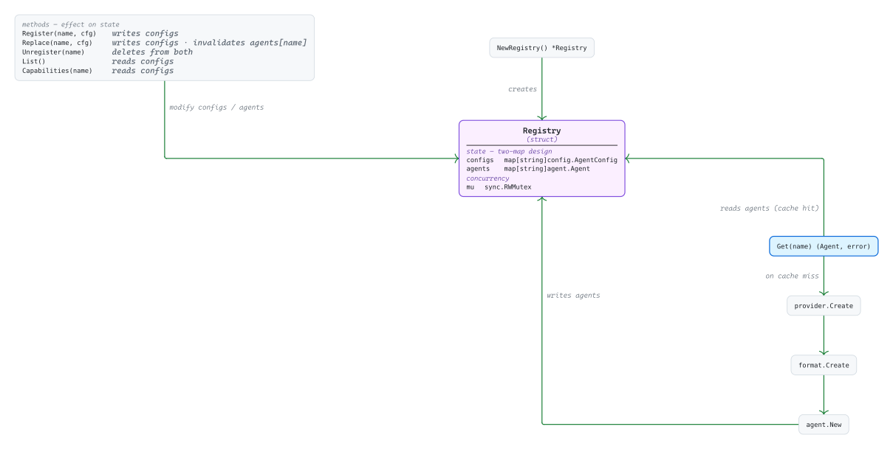

# [agent](https://github.com/tailored-agentic-units/agent)

Library: github.com/tailored-agentic-units/agent  
Language: Go  
Native dependencies:
- [protocol](../protocol/)
- [format](../format/)
- [provider](../provider/)

External dependencies:
- [google/uuid](https://github.com/google/uuid)

<picture>
  <source media="(prefers-color-scheme: dark)" srcset="./core/readme-dark.svg">
  
</picture>

The agent library is the addressable LLM unit application code talks to — a single instance binding a provider, a format, a model, and an HTTP client into one named entity that exposes chat, vision, tools, and embeddings as protocol-specific methods. Streaming variants of chat and vision deliver results over Go channels; everything else returns a single response value, with retry, identity, and lifecycle handled inside.

## Operational

<picture>
  <source media="(prefers-color-scheme: dark)" srcset="./operational/readme-dark.svg">
  
</picture>

The agent module imports three native TAU modules (`protocol`, `format`, `provider`) plus a single external utility (`google/uuid`, used to mint UUIDv7 identities at construction). Inner sub-packages partition the runtime: `client/` drives HTTP execution with a configurable retry policy (`MaxRetries`, `InitialBackoff`, `MaxBackoff`, `Jitter` applied on transient HTTP 429/502/503/504 and network errors), `request/` carries the four protocol-specific request types, `registry/` stores named agent configurations with lazy instantiation, and `mock/` ships test doubles for offline integration tests. Configuration flows through `config.AgentConfig` — a composite of provider, format, model, and client config — consumed at construction time.

## Specification

<picture>
  <source media="(prefers-color-scheme: dark)" srcset="./specification/readme-dark.svg">
  
</picture>

`Agent` is an eleven-method interface. Five accessors surface the agent's identity and its injected dependencies: `ID()` returns a stable UUIDv7 assigned at construction; `Client()`, `Provider()`, `Format()`, and `Model()` return the wired-in dependencies. Six protocol methods drive the request lifecycle — `Chat`, `ChatStream`, `Vision`, `VisionStream`, `Tools`, and `Embed`. The streaming variants of chat and vision return a `<-chan *response.StreamingResponse`; the other methods return `*response.Response` or, for `Embed`, `*response.EmbeddingsResponse`. `New(cfg, provider, format)` is the only constructor — it injects dependencies explicitly and merges per-protocol model defaults from `model.Options[protocol.Protocol]` with request-time options on every call. Errors raised across the surface use `AgentError`, a structured error with `init` / `llm` categorization, a UUIDv4 instance ID for log correlation, and functional-option constructors (`WithCode`, `WithCause`, `WithName`, `WithAgent`).

### Request Types

<picture>
  <source media="(prefers-color-scheme: dark)" srcset="./specification/request-types-dark.svg">
  
</picture>

All four concrete request types implement the `Request` interface (`Protocol`, `Headers`, `Marshal`, `Provider`, `Model`), but each carries a different protocol-specific payload. `ChatRequest` and `ToolsRequest` share `[]protocol.Message`; `VisionRequest` adds `[]format.Image` and a separate `visionOptions` map; `ToolsRequest` adds `[]format.ToolDefinition`; `EmbeddingsRequest` replaces the messages slice with an `input any` field. The four shared dependency fields (`prov`, `fmt`, `mdl`, `options`) are common to every type. `Marshal()` on each delegates to `format.Format.Marshal(protocol, data)`, passing a protocol-keyed format data struct (`&format.ChatData{...}`, `&format.VisionData{...}`, `&format.ToolsData{...}`, `&format.EmbeddingsData{...}`). Each type is constructed via `request.NewChat`, `request.NewVision`, `request.NewTools`, or `request.NewEmbeddings` from inside the agent's protocol methods.

### Registry

<picture>
  <source media="(prefers-color-scheme: dark)" srcset="./specification/registry-dark.svg">
  
</picture>

`Registry` stores `AgentConfig` values at registration time in `configs` and materializes `Agent` instances lazily in `agents` on first `Get`. `Get(name)` resolves `provider.Create(cfg.Provider)` and `format.Create(cfg.Format)` from their respective global registries, then calls `agent.New(cfg, p, f)` — this is the only point where provider and format instances are actually constructed for a registered agent. `Replace(name, cfg)` invalidates the cached instance by deleting from `agents`; the next `Get` re-runs the full construction path. `Unregister(name)` removes from both maps. `List()` and `Capabilities(name)` read configs only, with no instantiation. All operations gate on a `sync.RWMutex` so concurrent callers can `Get` and `List` without contention while writes serialize.
