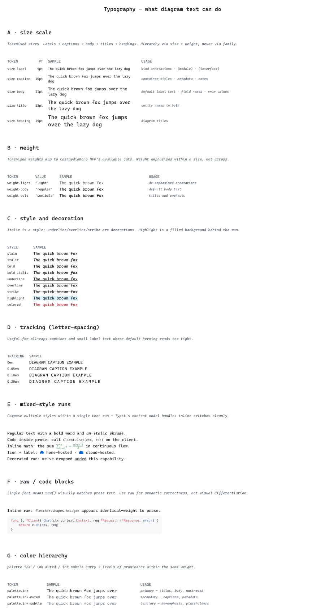
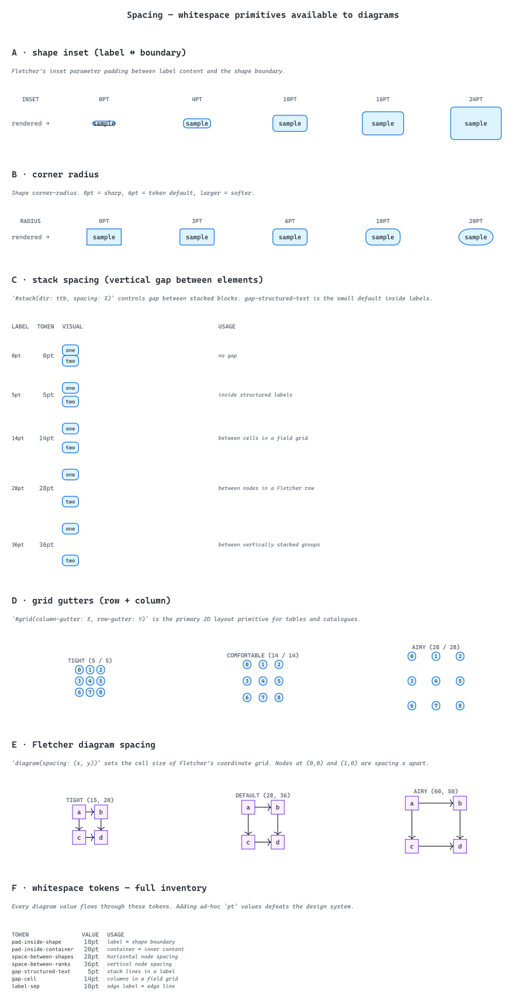
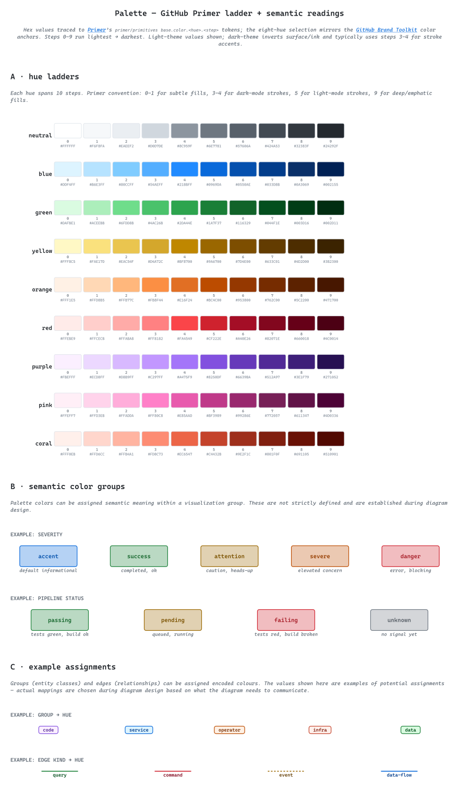
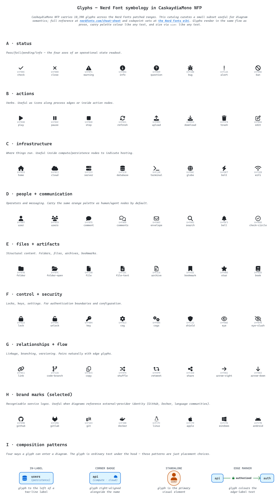
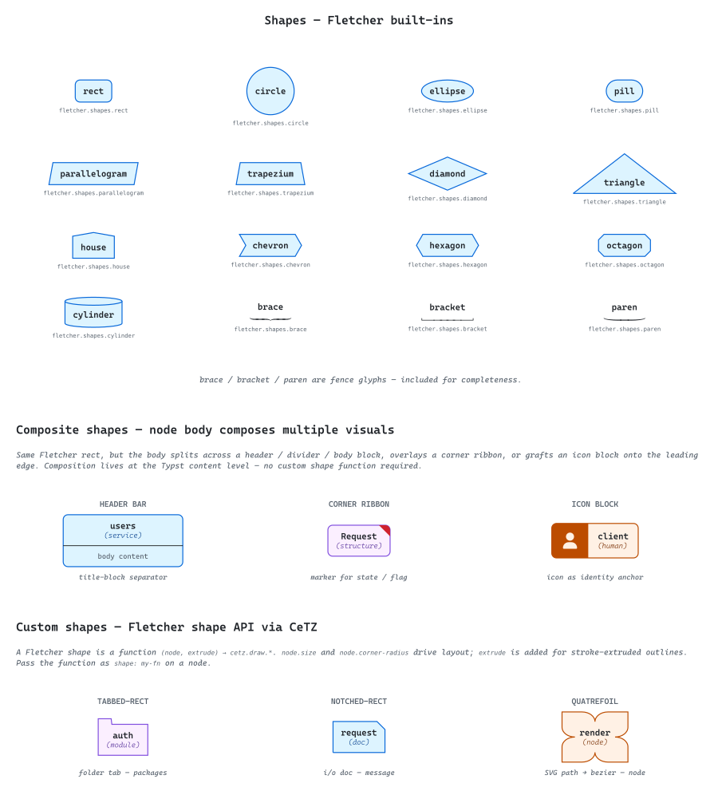
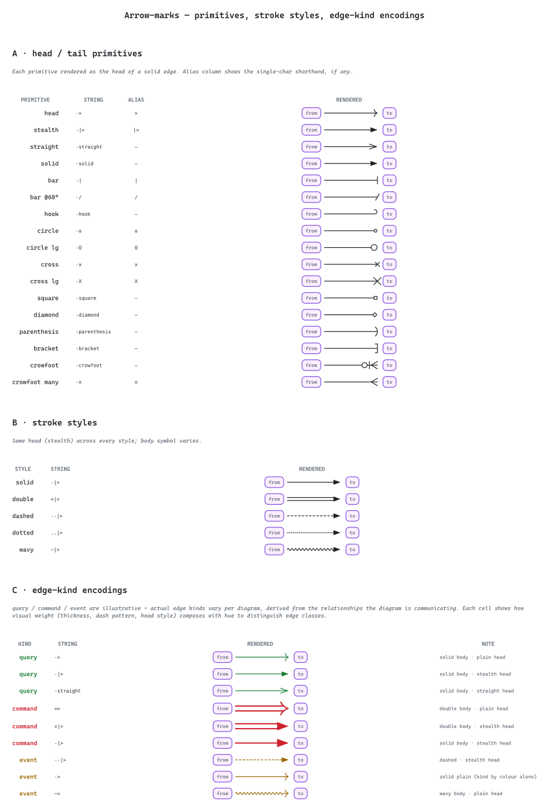
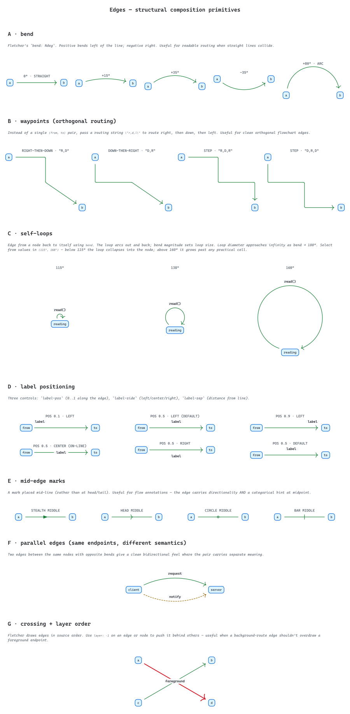
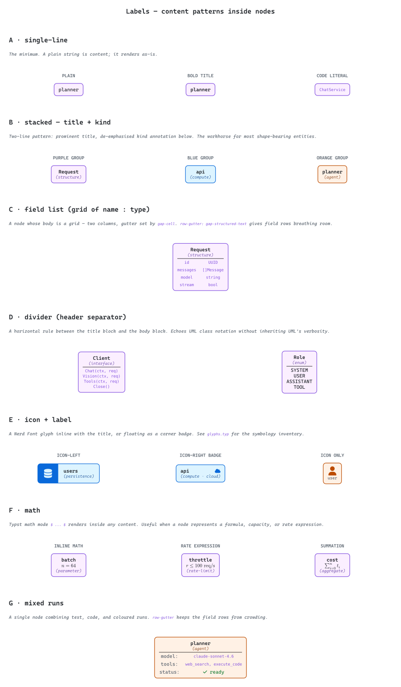
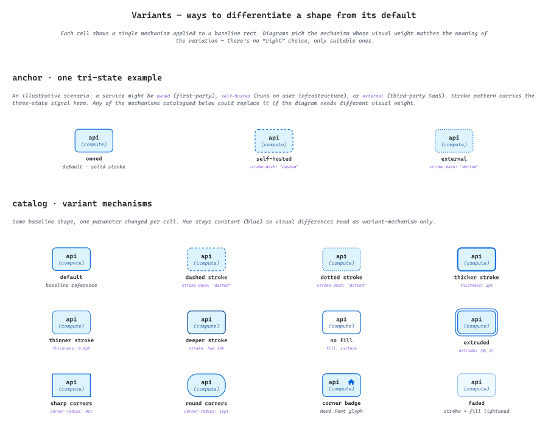
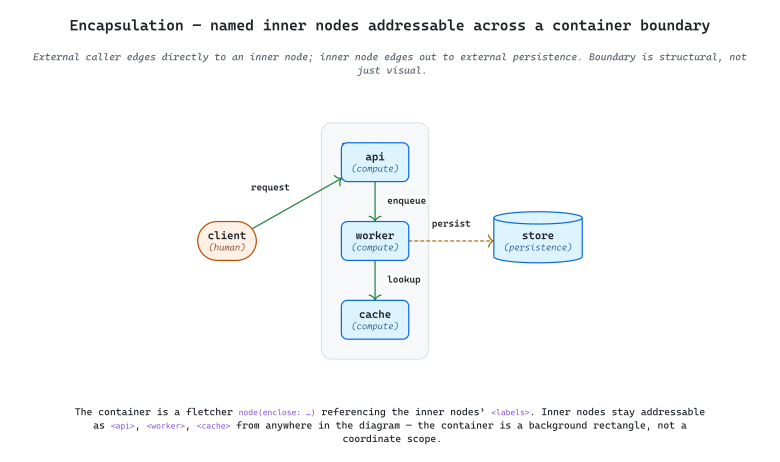

# Catalog

Visual specification for the diagram toolkit skill built around [typst](https://github.com/typst/typst), [cetz](https://github.com/cetz-package/cetz), and [fletcher](https://github.com/Jollywatt/typst-fletcher). Each `.typ` file is a single concept rendered at full resolution as both light and dark SVGs. Together they form the **ingredient list** an author draws from when composing a diagram — typography, colour, shapes, edges, glyphs, and the patterns that combine them.

The catalog is descriptive, not prescriptive. It shows what is *achievable* and how each option *reads*, not what a given concept *must* look like. Pick the ingredients whose visual weight carries the meaning your diagram needs.

Each entry below renders the catalog file at the user's system theme via the GitHub `<picture>` convention.

---

## typography

Tokenised size scale, weight, style, decoration, tracking, mixed runs, raw text, and colour hierarchy. Establishes the single-font conventions every other diagram inherits.

<picture>
  <source media="(prefers-color-scheme: dark)" srcset="./typography-dark.svg">
  
</picture>

---

## spacing

Whitespace primitives: inset, corner radius, stack spacing, grid gutters, Fletcher diagram spacing, and the underlying token inventory. The vocabulary for "how much breathing room" goes where.

<picture>
  <source media="(prefers-color-scheme: dark)" srcset="./spacing-dark.svg">
  
</picture>

---

## palette

Eight chromatic hue ladders traced to GitHub Primer primitives, plus semantic colour groups and example assignments. Colour is named by hue (`blue`, `green`, ...), never by domain — diagrams pick a hue based on what their content needs to communicate.

<picture>
  <source media="(prefers-color-scheme: dark)" srcset="./palette-dark.svg">
  
</picture>

---

## glyphs

Curated Nerd Font symbology from CaskaydiaMono NFP — status, actions, infrastructure, people, files, control, relationships, brands, and the four composition patterns (in-label, corner badge, standalone, edge marker).

<picture>
  <source media="(prefers-color-scheme: dark)" srcset="./glyphs-dark.svg">
  
</picture>

---

## shapes

Every Fletcher 0.5.8 built-in shape (4×4 grid), composite shapes that compose multiple visuals at the Typst content level, and custom shapes built via the CeTZ closure API.

<picture>
  <source media="(prefers-color-scheme: dark)" srcset="./shapes-dark.svg">
  
</picture>

---

## marks

Edge mark primitives: head and tail glyphs, stroke styles, and illustrative edge-kind encodings. The vocabulary for "what kind of relationship" an edge carries.

<picture>
  <source media="(prefers-color-scheme: dark)" srcset="./marks-dark.svg">
  
</picture>

---

## edges

Edge composition primitives beyond marks: bend, waypoints (orthogonal routing), self-loops, label positioning, mid-edge marks, parallel edges, and crossing / layer order.

<picture>
  <source media="(prefers-color-scheme: dark)" srcset="./edges-dark.svg">
  
</picture>

---

## labels

Content patterns inside nodes: single-line, stacked title + kind, field list, divider (header separator), icon + label, math expressions, and mixed-style runs.

<picture>
  <source media="(prefers-color-scheme: dark)" srcset="./labels-dark.svg">
  
</picture>

---

## variants

Every viable way to differentiate a shape from its default — stroke pattern, thickness, colour, fill, geometry, overlay, and fade. Includes a tri-state anchor example showing variants combined with corner badges.

<picture>
  <source media="(prefers-color-scheme: dark)" srcset="./variants-dark.svg">
  
</picture>

---

## encapsulation

A runtime container holding named inner nodes that are addressable across the boundary. The only responsive (visualization-style) catalog entry; the rest are static page-style references.

<picture>
  <source media="(prefers-color-scheme: dark)" srcset="./encapsulation-dark.svg">
  
</picture>
