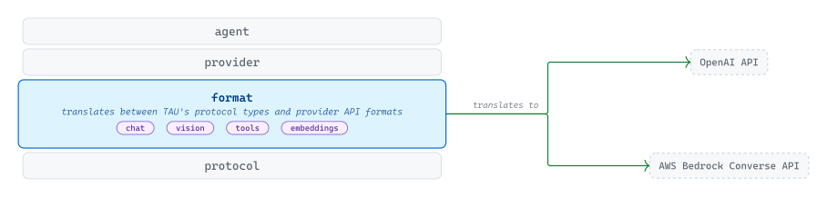
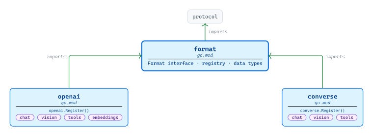
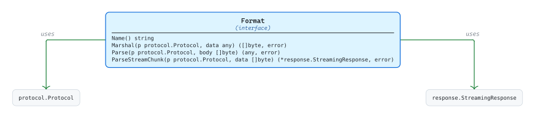
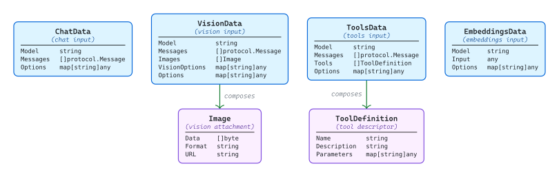
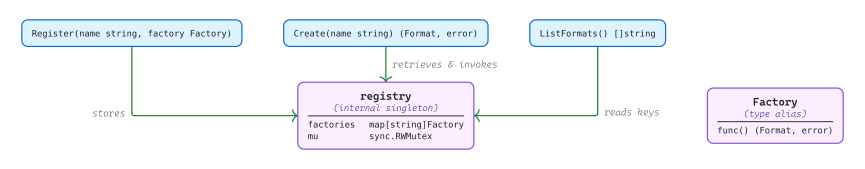

# [format](https://github.com/tailored-agentic-units/format)

Library: github.com/tailored-agentic-units/format  
Language: Go  
Native dependencies:
- [protocol](../protocol/)

<picture>
  <source media="(prefers-color-scheme: dark)" srcset="./core/readme-dark.svg">
  
</picture>

The format library is TAU's translation boundary between the shared protocol vocabulary and the JSON dialects of specific LLM APIs. Each provider's wire format ships as a self-contained sub-module that speaks one API's language — adding a new format extends the system without modifying the protocol, providers, or agents above it.

## Operational

<picture>
  <source media="(prefers-color-scheme: dark)" srcset="./operational/readme-dark.svg">
  
</picture>

Each sub-module (`openai`, `converse`) ships its own `go.mod` and imports the root `format` module and `protocol`; provider-specific dependencies never leak upward, and the root itself has no cloud SDK dependency. Registration is explicit — a caller invokes `Register()` on the sub-module before calling `format.Create(name)` — keeping side effects visible and `init()`-free.

## Specification

<picture>
  <source media="(prefers-color-scheme: dark)" srcset="./specification/readme-dark.svg">
  
</picture>

`Format` is a four-method interface every implementation satisfies. `Name()` identifies the implementation; `Marshal` serializes a protocol-keyed input struct into a request body; `Parse` deserializes a response body into a protocol-keyed output; `ParseStreamChunk` deserializes a single streaming event into a `*response.StreamingResponse`. The signatures cross into `protocol.Protocol` (the capability discriminator) and `response.StreamingResponse` from the protocol library — both referenced, neither re-exported.

### Data types

<picture>
  <source media="(prefers-color-scheme: dark)" srcset="./specification/data-types-dark.svg">
  
</picture>

Four protocol-keyed input structs flow into `Format.Marshal` as the `data any` parameter. `ChatData`, `VisionData`, and `ToolsData` carry `[]protocol.Message` and a free-form `Options` map; `VisionData` adds image attachments via the composed `Image` struct, and `ToolsData` adds `[]ToolDefinition`. `EmbeddingsData` is structurally separate — its `Input` is `any` and there are no messages, reflecting that embeddings are a different output kind from conversational responses.

### Registry

<picture>
  <source media="(prefers-color-scheme: dark)" srcset="./specification/registry-dark.svg">
  
</picture>

A package-level singleton stores a `name → Factory` map guarded by a `sync.RWMutex`. `Register(name, factory)` writes the factory under its name; `Create(name)` reads the factory and invokes it to produce a `Format` instance; `ListFormats()` returns the registered names for introspection. `Factory` is a type alias for `func() (Format, error)` — the constructor each sub-module supplies when it registers itself.

## Implementations

- [openai](./openai/) — wire format for OpenAI-compatible APIs (chat, vision, tools, embeddings, with streaming)
- [converse](./converse/) — wire format for the AWS Bedrock Converse API (chat, vision, tools)
