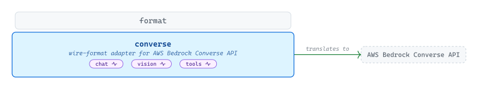
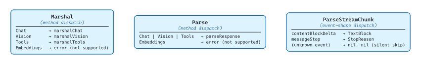
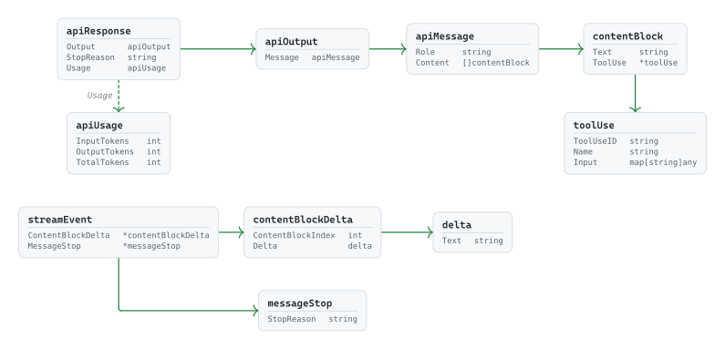

# [converse](https://github.com/tailored-agentic-units/format/tree/main/converse)

Library: github.com/tailored-agentic-units/format/converse  
Language: Go  
Native dependencies:
- [format](../)
- [protocol](../../protocol/)

<picture>
  <source media="(prefers-color-scheme: dark)" srcset="./core/readme-dark.svg">
  
</picture>

The `converse` sub-module translates TAU's shared conversation types into the JSON dialect spoken by AWS Bedrock Converse, covering chat, vision, and tool use — with streaming on all three. It registers itself under the key `"converse"` so any layer of the TAU system can request Bedrock Converse serialization by name without importing or knowing about the wire format directly. Embeddings is intentionally absent: Bedrock Converse does not support embeddings, and this sub-module errors hard rather than silently passing the request through.

## Specification

<picture>
  <source media="(prefers-color-scheme: dark)" srcset="./specification/readme-dark.svg">
  
</picture>

`Format` implements `format.Format` as a zero-value struct. `Marshal` dispatches to three private functions across `Chat`, `Vision`, and `Tools`; `Embeddings` errors immediately with "not supported by Converse API". `Parse` coalesces all three supported protocols onto a single `parseResponse` path because Bedrock Converse returns the same `output.message.content` envelope regardless of which protocol initiated the request. `ParseStreamChunk` is event-shape-keyed rather than protocol-keyed — it ignores its `protocol.Protocol` argument, dispatches on which optional field of `streamEvent` is non-nil, and returns `nil, nil` for unrecognized event shapes. The silent-skip contract is the key behavioral distinction from `format/openai`, whose `ParseStreamChunk` errors on `Embeddings` rather than skipping unknown events.

### Wire Types

<picture>
  <source media="(prefers-color-scheme: dark)" srcset="./specification/wire-types-dark.svg">
  
</picture>

The package defines two families of unexported wire types — one fewer than `format/openai` because there is no Embeddings counterpart. The non-streaming family (`apiResponse → apiOutput → apiMessage → contentBlock`) mirrors Bedrock's `output.message.content` envelope; `contentBlock` is a discriminated union carrying either a `Text` string or a `*ToolUse` pointer, and `parseResponse` iterates both, emitting `response.TextBlock` or `response.ToolUseBlock` per entry. The streaming family is also a discriminated union: `streamEvent` exposes optional `*contentBlockDelta` and `*messageStop` fields, and `ParseStreamChunk` returns the appropriate `StreamingResponse` for whichever is non-nil — silently skipping events like `messageStart` that Bedrock emits but the TAU streaming contract does not surface. `apiUsage` already uses TAU's `InputTokens` / `OutputTokens` naming directly, so no field-name remapping is needed at parse time.
