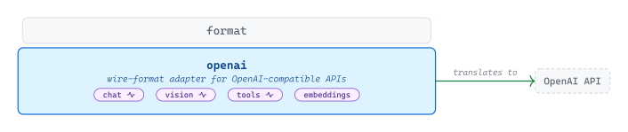
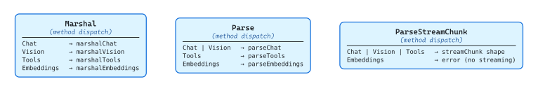
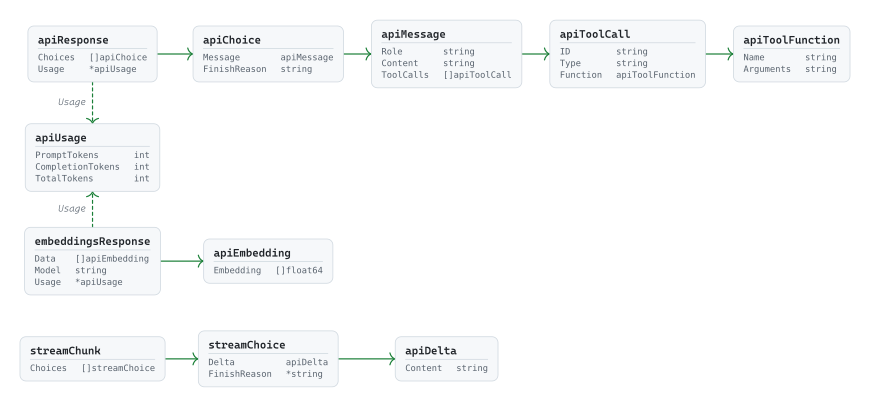

# [openai](https://github.com/tailored-agentic-units/format/tree/main/openai)

Library: github.com/tailored-agentic-units/format/openai  
Language: Go  
Native dependencies:
- [format](../)
- [protocol](../../protocol/)

<picture>
  <source media="(prefers-color-scheme: dark)" srcset="./core/readme-dark.svg">
  
</picture>

The `openai` sub-module translates TAU's shared conversation types into the JSON dialect spoken by OpenAI-compatible APIs, covering chat, vision, tool use, and embeddings — with streaming on the first three. It registers itself under the key `"openai"` so any layer of the TAU system can request it by name without the calling code importing or knowing about OpenAI's wire format directly.

## Specification

<picture>
  <source media="(prefers-color-scheme: dark)" srcset="./specification/readme-dark.svg">
  
</picture>

`Format` implements `format.Format` as a zero-value struct; its `Marshal` and `Parse` methods dispatch on `protocol.Protocol` to per-protocol private functions. `Parse` coalesces `Chat` and `Vision` onto a single `parseChat` path because OpenAI returns the same response shape for both. Vision marshaling is the most structurally distinct path — it rewrites the last message's content into OpenAI's multipart array, interleaving `text` and `image_url` blocks before serialization. `ParseStreamChunk` reads the SSE delta shape (`streamChunk → streamChoice → apiDelta`) and errors on `protocol.Embeddings`, which OpenAI's streaming endpoint does not support.

### Wire Types

<picture>
  <source media="(prefers-color-scheme: dark)" srcset="./specification/wire-types-dark.svg">
  
</picture>

The package defines three families of unexported wire types that mirror OpenAI's JSON shapes. The non-streaming family (`apiResponse → apiChoice → apiMessage → apiToolCall → apiToolFunction`) handles all non-streaming responses, with `apiMessage.ToolCalls` carrying the tool-use entries that `parseTools` extracts as `response.ToolUseBlock` values. The streaming family (`streamChunk → streamChoice → apiDelta`) handles SSE delta events, surfacing only `Content` text and a `FinishReason`. `embeddingsResponse → apiEmbedding` is structurally separate — embeddings are a different output kind, not a third response variant. `apiUsage` is shared across the non-streaming and embeddings families, mapping OpenAI's `prompt_tokens` / `completion_tokens` fields to TAU's `InputTokens` / `OutputTokens`.
