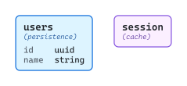
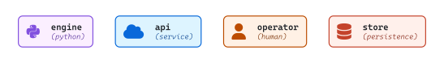
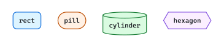
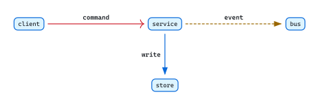
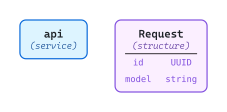

# Ingredients

A composable toolkit for diagram authoring. Each ingredient is described with its visual weight and useful applications, never as a "this means that" rule. There's no canonical mapping of shapes to concepts or hues to meanings — diagrams choose each ingredient based on what their content needs to communicate.

The inventory is organized into five axes. Each axis is a separate sub-directory holding standalone single-concept diagrams (one source `.typ` produces one rendered artifact at full resolution) plus a README that orders them with prose. Browse an axis end-to-end for a topical tour, or jump to a specific concept when you need a refresher on its visual weight.

The five axes are independent — you can pull from any of them in any combination when authoring a new diagram. They appear below in roughly foundational → composed order: typography and whitespace come first because every other ingredient sits on top of them; encapsulation comes last because it composes label-bearing nodes into containers.

## [text and space](./text-and-space/README.md)

<picture>
  <source media="(prefers-color-scheme: dark)" srcset="./text-and-space/readme-dark.svg">
  
</picture>

Typography (size, weight, style, decoration, tracking, color) shapes the text inside a label; whitespace primitives (insets, gutters, gaps) shape the space around it. Hierarchy is expressed through weight + size, never through font family — every diagram uses the same single font (CaskaydiaMono NFP).

## [color and glyphs](./color-and-glyphs/README.md)

<picture>
  <source media="(prefers-color-scheme: dark)" srcset="./color-and-glyphs/readme-dark.svg">
  
</picture>

Chromatic hues (and their four-attribute quad: stroke, fill, ink, divider) plus Nerd Font glyphs from 13 source families covering languages, frameworks, infrastructure, source control, file types, weather, power, and more. The palette is color-anchored and the glyph inventory is comprehensive — diagrams choose what their content needs.

## [shapes and variants](./shapes-and-variants/README.md)

<picture>
  <source media="(prefers-color-scheme: dark)" srcset="./shapes-and-variants/readme-dark.svg">
  
</picture>

The shape vocabulary an author picks from when assigning visual identity to entities — Fletcher built-ins, composite shapes (built-in outline + composed body), custom shapes (CeTZ-defined outline) — plus mechanisms for differentiating instances of the same shape. Shape and hue compose orthogonally as two visual axes.

## [edges and marks](./edges-and-marks/README.md)

<picture>
  <source media="(prefers-color-scheme: dark)" srcset="./edges-and-marks/readme-dark.svg">
  
</picture>

Edges connect nodes; marks are the head/tail glyphs on edges. The mark inventory differentiates kinds (read vs write vs event); routing primitives (bend, waypoints, self-loops, layer) determine how the line gets drawn. A diagram typically uses 1-3 mark types — many fragment the visual vocabulary.

## [labels and encapsulation](./labels-and-encapsulation/README.md)

<picture>
  <source media="(prefers-color-scheme: dark)" srcset="./labels-and-encapsulation/readme-dark.svg">
  
</picture>

Content patterns inside nodes (single-line, stacked title+kind, field list, divider, icon, math, mixed runs) plus the container pattern that lets external nodes address inner nodes across a boundary. Labels carry the per-node identity and payload; encapsulation gives the diagram a way to group nodes structurally without breaking edge addressability.
