# Color and glyphs

<picture>
  <source media="(prefers-color-scheme: dark)" srcset="./readme-dark.svg">
  
</picture>

Two ingredient categories that work closely together: chromatic hues (and their four-attribute quad) and Nerd Font glyphs (and the four ways to compose them into a diagram). A diagram chooses a hue for what its content needs to differentiate, then glyphs add semantic identity inside the chromatic frame.

## Color

The palette is **color-anchored**: hues are named (`blue`, `green`, `orange`, …), not function-named (`palette.success`, `palette.error`). Each diagram makes its own hue → meaning assignment based on what it needs to communicate.

### Hue ladders

The Primer 10-step ladder is the source data behind the four-attribute quad each hue exposes (`stroke`, `fill`, `ink`, `divider`). Steps 0-1 supply subtle fills; step 5 supplies the canonical stroke; step 7 supplies the deep ink for chromatic text on tinted fills.

<picture>
  <source media="(prefers-color-scheme: dark)" srcset="./hue-ladders-dark.svg">
  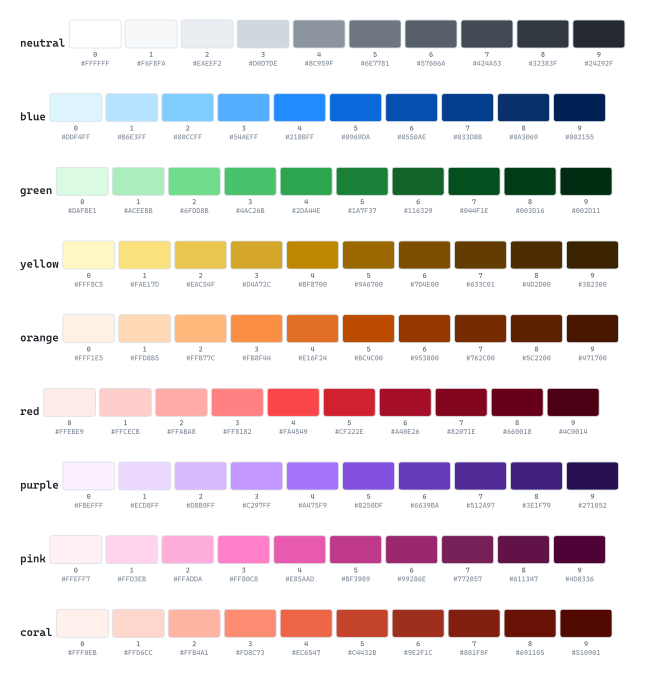
</picture>

### Semantic groups

Hues can carry meaning within a visualization group. Two illustrative ladders: severity (blue → green → yellow → orange → red, ordered by escalating concern) and pipeline status (green/yellow/red/neutral mapped to passing/pending/failing/unknown).

<picture>
  <source media="(prefers-color-scheme: dark)" srcset="./semantic-groups-dark.svg">
  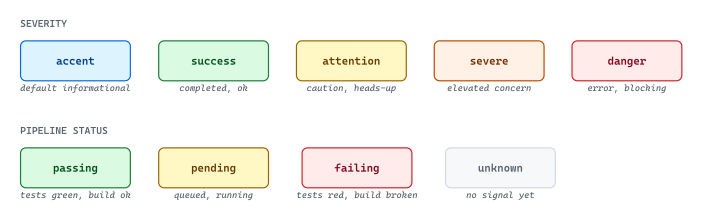
</picture>

### Example assignments

Group → hue and edge-kind → hue mappings. These are reference points, not rules — any diagram is free to remap based on its content.

<picture>
  <source media="(prefers-color-scheme: dark)" srcset="./example-assignments-dark.svg">
  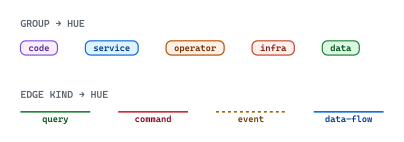
</picture>

## Glyphs

A Nerd Font is a **patched** font: original Latin/code glyphs at standard codepoints, plus icon glyphs from 13 source fonts overlaid into the Unicode Private Use Area. CaskaydiaMono NFP carries all 13 patched ranges. Glyphs are ordinary text — they size, color, and compose like any other text.

### Glyph sources

The 13 source families a Nerd Font patches in. Knowing which source a glyph comes from helps reason about visual consistency: glyphs from the same source share stroke weight, optical alignment, and silhouette discipline.

<picture>
  <source media="(prefers-color-scheme: dark)" srcset="./glyph-sources-dark.svg">
  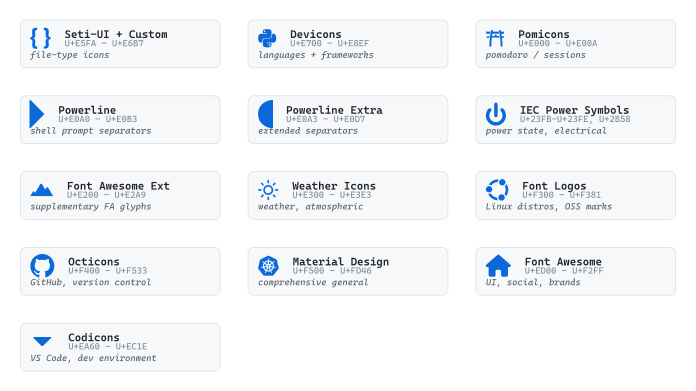
</picture>

### Composition patterns

Four placement patterns for a glyph entering a diagram. The glyph is ordinary text under the hood — these patterns are layout choices, not separate types.

<picture>
  <source media="(prefers-color-scheme: dark)" srcset="./composition-patterns-dark.svg">
  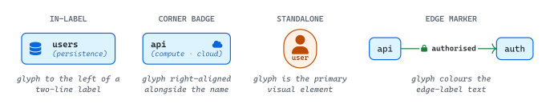
</picture>

### Status icons (Font Awesome + Codicons)

Pass / fail / pending / info — the four axes of an operational state readout.

<picture>
  <source media="(prefers-color-scheme: dark)" srcset="./status-icons-dark.svg">
  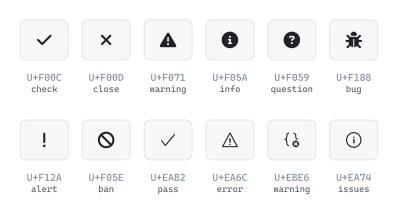
</picture>

### Action icons (Font Awesome + Codicons)

Verbs. Useful as icons along process edges or inside action nodes.

<picture>
  <source media="(prefers-color-scheme: dark)" srcset="./action-icons-dark.svg">
  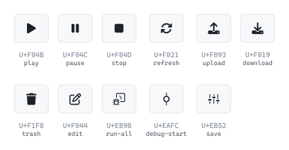
</picture>

### Infrastructure icons (Font Awesome + Material Design)

Where things run. Useful inside compute / persistence / network nodes to indicate hosting.

<picture>
  <source media="(prefers-color-scheme: dark)" srcset="./infrastructure-icons-dark.svg">
  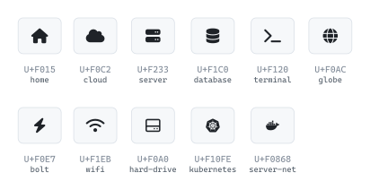
</picture>

### People and communication (Font Awesome)

Operators and messaging.

<picture>
  <source media="(prefers-color-scheme: dark)" srcset="./people-communication-dark.svg">
  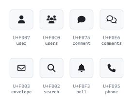
</picture>

### Files and artifacts (Font Awesome + Seti-UI)

Generic file structure (folders, files, archives) plus Seti-UI's editor-sidebar file-type icons.

<picture>
  <source media="(prefers-color-scheme: dark)" srcset="./files-artifacts-dark.svg">
  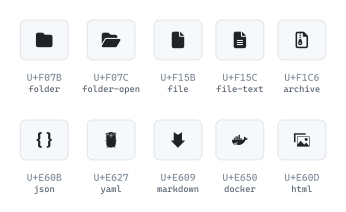
</picture>

### Control and security (Font Awesome + Codicons)

Locks, keys, settings — for authentication boundaries and configuration.

<picture>
  <source media="(prefers-color-scheme: dark)" srcset="./control-security-dark.svg">
  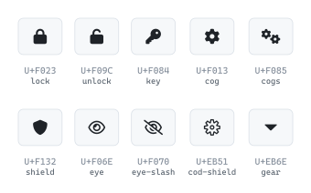
</picture>

### Relationships and flow (Font Awesome + Octicons)

Linkage, branching, versioning. Pairs naturally with edge glyphs.

<picture>
  <source media="(prefers-color-scheme: dark)" srcset="./relationships-flow-dark.svg">
  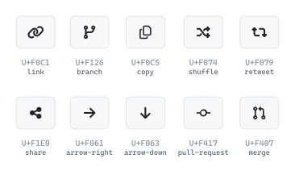
</picture>

### Brand marks (Font Awesome)

Companies and services not covered by Devicons / Font Logos.

<picture>
  <source media="(prefers-color-scheme: dark)" srcset="./brand-marks-dark.svg">
  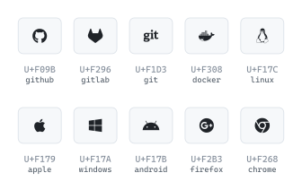
</picture>

### Programming languages (Devicons)

Devicons is the canonical source for "which language?" identification — every common language has a recognizable mark.

<picture>
  <source media="(prefers-color-scheme: dark)" srcset="./languages-dark.svg">
  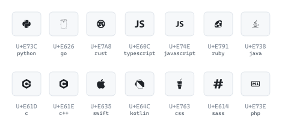
</picture>

### Frameworks and tools (Devicons + Material Design)

Web frameworks, databases, infra tools, message queues. The most-touched names; the wiki carries the long tail.

<picture>
  <source media="(prefers-color-scheme: dark)" srcset="./frameworks-and-tools-dark.svg">
  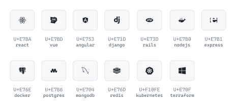
</picture>

### Linux distros (Font Logos)

Distribution marks. Useful when a diagram references an OS / runtime environment.

<picture>
  <source media="(prefers-color-scheme: dark)" srcset="./distros-dark.svg">
  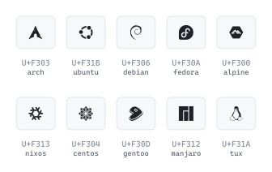
</picture>

### Source control (Octicons + Codicons)

Git / GitHub operations. Octicons is the canonical source for VCS semantics.

<picture>
  <source media="(prefers-color-scheme: dark)" srcset="./source-control-dark.svg">
  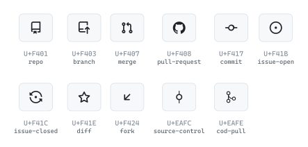
</picture>

### Dev environment (Codicons)

VS Code's UI vocabulary — debug, terminal, output, problem, breakpoint, source-control. Codicons is the canonical source for IDE semantics.

<picture>
  <source media="(prefers-color-scheme: dark)" srcset="./dev-environment-dark.svg">
  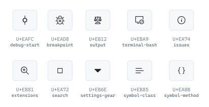
</picture>

### Weather (Weather Icons)

Atmospheric conditions, forecasts. Useful in environmental / IoT / climate diagrams.

<picture>
  <source media="(prefers-color-scheme: dark)" srcset="./weather-dark.svg">
  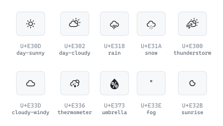
</picture>

### Shell prompt (Powerline + Powerline Extra)

Separator and divider geometry for terminal prompts and shell-style framing. Useful as connector chevrons in flow diagrams or section dividers in terminal-style mockups.

<picture>
  <source media="(prefers-color-scheme: dark)" srcset="./shell-prompt-dark.svg">
  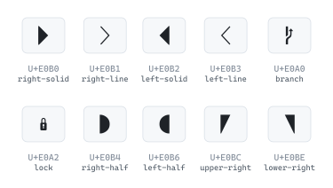
</picture>

### Power and session (IEC Power Symbols + Pomicons)

Power state (the universal on/off/standby vocabulary) and Pomodoro session indicators (focus / break cycles). Tiny inventories with distinct visual identity.

<picture>
  <source media="(prefers-color-scheme: dark)" srcset="./power-and-session-dark.svg">
  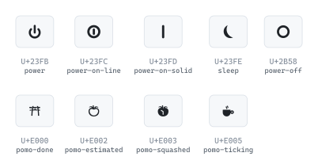
</picture>
