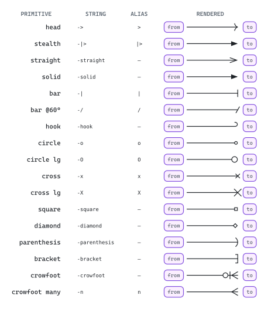
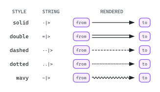
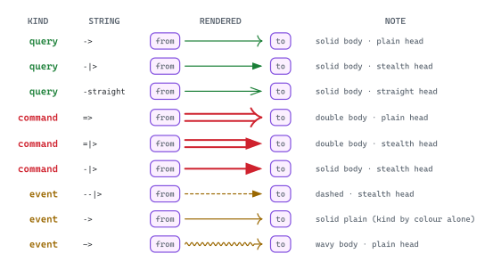
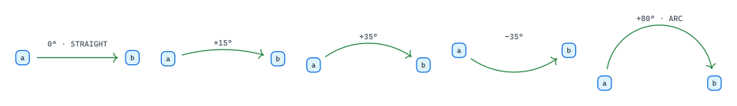
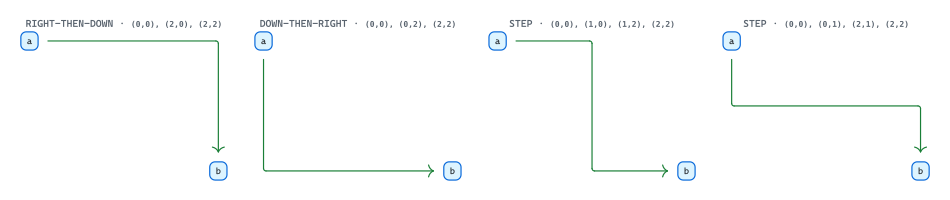
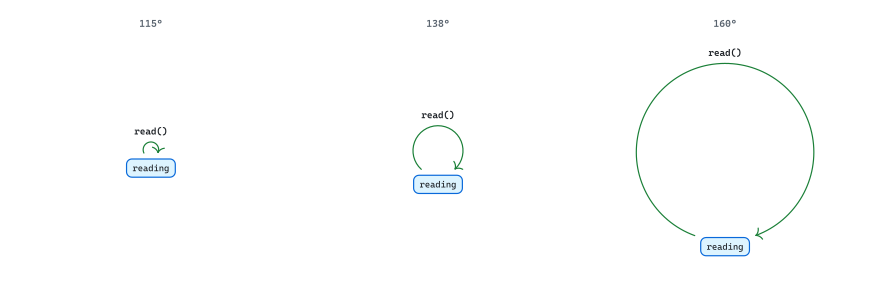
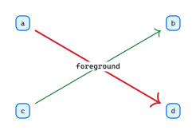
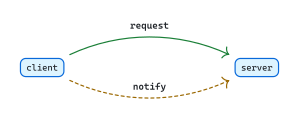
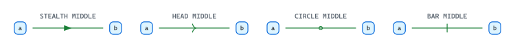
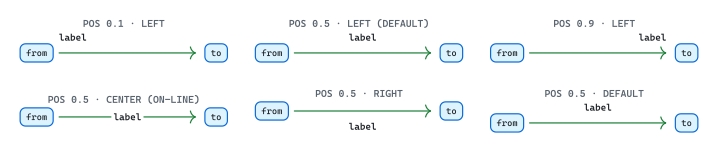

# Edges and marks

<picture>
  <source media="(prefers-color-scheme: dark)" srcset="./readme-dark.svg">
  
</picture>

Edges connect nodes; marks are the head/tail glyphs on edges. Together they carry the relationships in a diagram. Mark vocabulary differentiates kinds (read vs write vs event); routing primitives (bend, waypoints, self-loops) determine how the line gets drawn between endpoints.

## Marks and stroke styles

The visual library of head/tail glyphs and body styles. Mark + body compose freely — `--|>` is dashed body + stealth head; `=>` is double body + plain head.

### Head and tail primitives

Fletcher's full mark inventory. A typical diagram uses 1-3 mark types — many distinct marks fragment the visual vocabulary, so additional marks justify themselves only when each carries a distinct kind.

<picture>
  <source media="(prefers-color-scheme: dark)" srcset="./head-tail-primitives-dark.svg">
  
</picture>

### Stroke styles

Five body styles compose with any head/tail. Note: `~~` is *not* wavy; wavy uses a single `~`.

<picture>
  <source media="(prefers-color-scheme: dark)" srcset="./stroke-styles-dark.svg">
  
</picture>

### Edge-kind encodings

Diagrams often split edges into kinds. Visual weight (thickness, dash pattern, head, hue) composes to differentiate. The mappings below are illustrative — any diagram is free to remap based on its content.

<picture>
  <source media="(prefers-color-scheme: dark)" srcset="./edge-kind-encodings-dark.svg">
  
</picture>

## Routing

How the line gets drawn between endpoints. Default is straight; bends curve; waypoints route orthogonally; self-loops connect a node to itself.

### Bend

Positive bends left of a straight line from→to; negative bends right. Useful when straight routing collides with intervening nodes, or when two parallel edges need to differentiate (one `+25°`, the other `-25°`).

<picture>
  <source media="(prefers-color-scheme: dark)" srcset="./bend-dark.svg">
  
</picture>

### Waypoints

Pass a routing string instead of a `(from, to)` pair to step orthogonally. `"r,d"` reads "right then down"; mix segments freely (`l`, `u`, `d`, `r`).

<picture>
  <source media="(prefers-color-scheme: dark)" srcset="./waypoints-dark.svg">
  
</picture>

### Self-loops

An edge from a node back to itself. Reads as cyclic, recursive, or self-referential. The bend angle range that produces a clean loop: `(115°, 160°)`. Below 115° the loop hides inside the source node; at 180° the geometry diverges.

<picture>
  <source media="(prefers-color-scheme: dark)" srcset="./self-loops-dark.svg">
  
</picture>

A self-loop inside an `auto`-page-height document needs a fixed-size, clipped wrapper box; otherwise Fletcher's loop-extent computation and the page-height computation feed each other in a divergent loop.

### Layer order

Fletcher draws edges in source order. Use `layer: -1` to push an edge or node behind others — useful when a background-route edge shouldn't overdraw a foreground endpoint.

<picture>
  <source media="(prefers-color-scheme: dark)" srcset="./layer-order-dark.svg">
  
</picture>

## Composition

Two patterns built on top of routing + marks: parallel edges between the same endpoints, and mid-edge marks that ride the line.

### Parallel edges

Two edges between the same nodes, with opposite bends, separate visually so the pair reads as bidirectional — one relationship in each direction. Without bend separation, the visual collapses.

<picture>
  <source media="(prefers-color-scheme: dark)" srcset="./parallel-edges-dark.svg">
  
</picture>

### Mid-edge marks

A mark placed mid-line, separate from head/tail. The edge carries directionality (via head/tail) and a categorical hint at midpoint — useful for differentiating kinds without shifting the directional indicator.

<picture>
  <source media="(prefers-color-scheme: dark)" srcset="./mid-edge-marks-dark.svg">
  
</picture>

### Label positioning

Three controls: `label-pos` (0..1 along the edge), `label-side` (left/center/right), `label-sep` (distance from line). The default `label-pos: 0.5` collides with endpoints on short edges — anchor `0.7` near destination or `0.3` near source. `label-side: center` places the label *on* the line and reads as a transformation rather than annotation.

<picture>
  <source media="(prefers-color-scheme: dark)" srcset="./label-positioning-dark.svg">
  
</picture>
