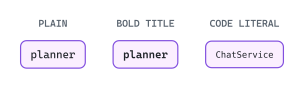
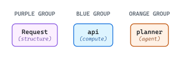
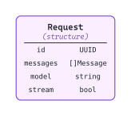
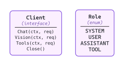
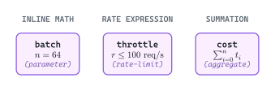
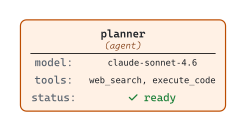
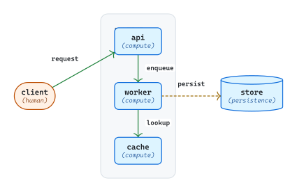

# Labels and encapsulation

<picture>
  <source media="(prefers-color-scheme: dark)" srcset="./readme-dark.svg">
  
</picture>

Content patterns inside nodes (the label) and the container pattern that lets external nodes address inner nodes across a boundary (encapsulation). Labels carry the per-node identity and payload; encapsulation gives the diagram a way to group nodes structurally without breaking edge addressability.

## Labels

A node body in Fletcher is content — anything that evaluates to content can be the body.

### Single-line

The minimum. A plain string or a single `text(...)` call. Reads as the bare identity of the node.

<picture>
  <source media="(prefers-color-scheme: dark)" srcset="./single-line-dark.svg">
  
</picture>

### Stacked: title + kind

A two-line pattern: prominent title, de-emphasized kind annotation below. The workhorse for shape-bearing entities — title carries identity, kind carries category, both within one node body.

<picture>
  <source media="(prefers-color-scheme: dark)" srcset="./stacked-title-kind-dark.svg">
  
</picture>

The kind annotation in italic + parentheses + `hue.ink` keeps it readable as "metadata about this node" without competing with the title.

### Field list

A grid of `name : type` rows. Useful for record-like entities, schemas, enums. `row-gutter: gap-structured-text * 2` keeps field rows from crowding; `column-gutter: gap-cell` separates name from type comfortably.

<picture>
  <source media="(prefers-color-scheme: dark)" srcset="./field-list-dark.svg">
  
</picture>

### Divider

A horizontal rule between the title block and the body block. Echoes UML class notation without the verbosity. The hue-aware `divider()` keeps the rule in the same color family as the surrounding fill.

<picture>
  <source media="(prefers-color-scheme: dark)" srcset="./divider-dark.svg">
  
</picture>

### Icon + label

Three placements (glyph inventory in [color and glyphs](../color-and-glyphs/README.md)): icon-left anchors identity with a leading icon block; icon-right corner badge adds a state hint without claiming the central position; icon-only carries the identity itself with a small caption.

<picture>
  <source media="(prefers-color-scheme: dark)" srcset="./icon-label-dark.svg">
  
</picture>

### Math

Math content (`$ ... $`) embeds anywhere content is expected. Useful when a node represents a formula, capacity, or rate expression. Wrap with `text(fill: ...)` for color.

<picture>
  <source media="(prefers-color-scheme: dark)" srcset="./math-dark.svg">
  
</picture>

### Mixed runs

A single node combining text, code, math, status glyphs, and colored runs. The constraint is legibility — does the composed body read at a glance — rather than what the layout primitives allow.

<picture>
  <source media="(prefers-color-scheme: dark)" srcset="./label-mixed-runs-dark.svg">
  
</picture>

## Encapsulation

Fletcher's `enclose:` parameter draws a container shape behind named inner nodes. The pattern lets external edges address inner nodes directly across the container boundary — the container is a background rectangle, not a coordinate scope, so inner nodes stay addressable from anywhere in the diagram by their `<name>` labels.

### Container pattern

External caller edges directly to an inner node; inner node edges out to external persistence. The boundary is structural, not just visual — `<api>`, `<worker>`, `<cache>` remain addressable as bare names from any edge in the diagram.

<picture>
  <source media="(prefers-color-scheme: dark)" srcset="./encapsulation-pattern-dark.svg">
  
</picture>

The container distinguishes itself from regular nodes via subtle styling: `palette.surface-muted` fill, `stroke-thin + palette.border` outline, generous `pad-inside-container` inset, and `snap: -1` so it renders behind the inner nodes.
