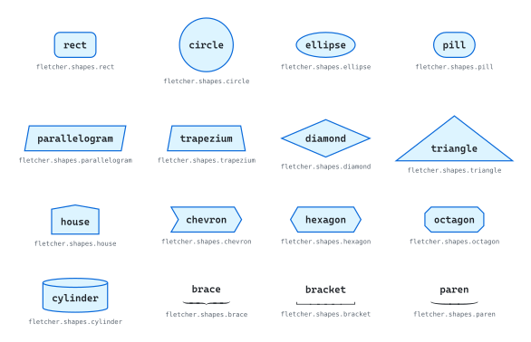
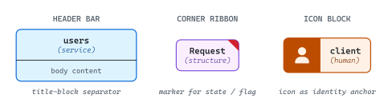
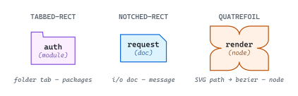
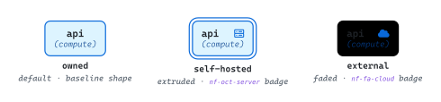
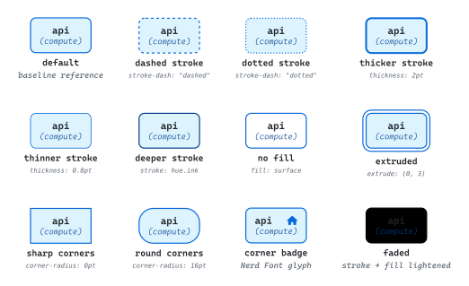

# Shapes and variants

<picture>
  <source media="(prefers-color-scheme: dark)" srcset="./readme-dark.svg">
  
</picture>

The shape vocabulary an author picks from when assigning visual identity to entities, plus the mechanisms for differentiating instances of the same shape. Shape and hue compose orthogonally — many shapes × many hues is two visual axes, justified only when both carry meaning.

## Shapes

Three layers: Fletcher's built-in primitives are the working inventory; composite shapes nest layout structures inside a built-in's outline; custom shapes redraw the outline itself.

### Built-in shapes

Fletcher's full shape inventory. The vocabulary differentiates along three orthogonal axes: symmetric vs directional (circle vs parallelogram), soft vs hard (pill vs octagon), and visual weight (rect recedes; octagon claims attention).

<picture>
  <source media="(prefers-color-scheme: dark)" srcset="./built-in-shapes-dark.svg">
  
</picture>

`brace`, `bracket`, and `paren` are fence glyphs — included for completeness but typically used as group annotations rather than primary entity shapes.

### Composite shapes

A composite keeps the Fletcher built-in but composes the *node body* from multiple visual elements. The shape stays a built-in (typically `rect`); the body uses Typst layout primitives to combine elements.

<picture>
  <source media="(prefers-color-scheme: dark)" srcset="./composite-shapes-dark.svg">
  
</picture>

Three workhorses cover most needs: the **header bar** carries title-on-top + body-below for UML-style class notation; the **corner ribbon** marks state or flag without changing the silhouette; the **icon block** anchors identity with a leading icon panel.

### Custom shapes

A custom shape is a Fletcher shape function `(node, extrude) → cetz.draw.*`. The outline is defined directly via CeTZ primitives — useful when the silhouette itself carries meaning (a folder tab signals "package"; a notch signals "i/o document").

<picture>
  <source media="(prefers-color-scheme: dark)" srcset="./custom-shapes-dark.svg">
  
</picture>

Composite shapes ride on top of an existing outline; custom shapes change the outline. A "rect with a header bar" is composite; a "rect with a folder tab" is custom because the tab extends the silhouette beyond a rect.

## Variants

Same shape, differentiated for state. Mechanisms span stroke, fill, geometry, overlay, and opacity — pick the mechanism whose visual weight matches the meaning of the variation.

### Anchor — one tri-state example

An illustrative scenario: a service might be **owned** (first-party), **self-hosted** (runs on user infrastructure), or **external** (third-party SaaS). Each state combines a geometry mechanism with a corner badge so the difference reads at a glance. Any of the catalogued mechanisms below could replace these if a diagram needs different visual weight.

<picture>
  <source media="(prefers-color-scheme: dark)" srcset="./anchor-tri-state-dark.svg">
  
</picture>

### Variant mechanisms catalog

Same baseline shape, one parameter changed per cell. Hue stays constant so visual differences read as variant-mechanism only. Variants compose: two signals reinforce each other or split the differentiation.

<picture>
  <source media="(prefers-color-scheme: dark)" srcset="./variant-mechanisms-dark.svg">
  
</picture>
