# Text and space

<picture>
  <source media="(prefers-color-scheme: dark)" srcset="./readme-dark.svg">
  
</picture>

Two ingredient categories that work in tandem: typography (size, weight, style, decoration, tracking, color) shapes the text inside a label; whitespace primitives (insets, gutters, gaps) shape the space around it. Hierarchy is expressed through weight + size, never through font family — every diagram uses the same single font (CaskaydiaMono NFP).

## Typography

The five-axis substrate: any label composes from size × weight × style × decoration × color. They overlay orthogonally — each diagram picks what its labels need.

### Size scale

Five token slots cover the typical diagram. The scale is multiplicative (~1.1–1.2× per step), so adjacent sizes express promotion and de-emphasis without dramatic visual jumps.

<picture>
  <source media="(prefers-color-scheme: dark)" srcset="./size-scale-dark.svg">
  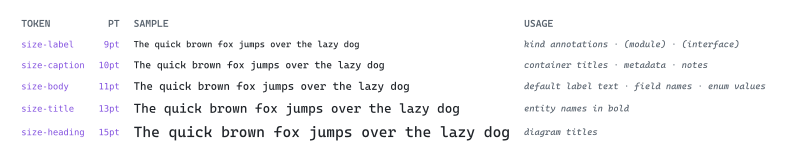
</picture>

### Weight

Three cuts: light for de-emphasized annotations, body for default, bold for titles and emphasis. Weight changes prominence within a size without shifting vertical metrics.

<picture>
  <source media="(prefers-color-scheme: dark)" srcset="./weight-dark.svg">
  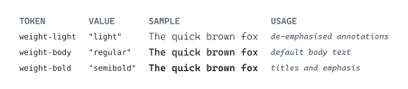
</picture>

### Style and decoration

Italic is a style; underline / overline / strike / highlight are decorations. They overlay on any size + weight combination. Use sparingly — decoration competes with stroke colors for attention.

<picture>
  <source media="(prefers-color-scheme: dark)" srcset="./style-decoration-dark.svg">
  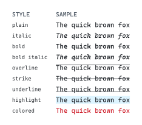
</picture>

### Tracking

Letter-spacing. Default kerning works for most label sizes; open up tracking for all-caps captions and very small labels (≤8pt) where default kerning reads too tight.

<picture>
  <source media="(prefers-color-scheme: dark)" srcset="./tracking-dark.svg">
  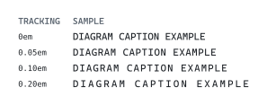
</picture>

### Color hierarchy

Three levels of neutral ink layered on top of size + weight give smooth de-emphasis: `palette.ink` (must-read), `palette.ink-muted` (secondary), `palette.ink-subtle` (tertiary). When a label sits on a hue-tinted fill, switch to `palette.<hue>.ink` to keep the label in the hue family.

<picture>
  <source media="(prefers-color-scheme: dark)" srcset="./color-hierarchy-dark.svg">
  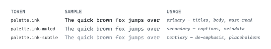
</picture>

### Mixed-style runs

Inline composition switches style mid-content. A single inline emphasis fits as a `#text(...)[...]` switch within a run; title + kind on separate lines composes via `stack(...)`.

<picture>
  <source media="(prefers-color-scheme: dark)" srcset="./mixed-runs-dark.svg">
  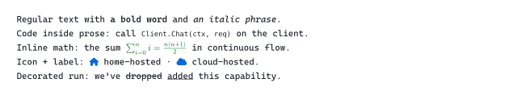
</picture>

### Raw / code

`raw(...)` and backtick spans mark code-style content. Because prose and `raw()` share the same font family, code requires a fill color (the project default is purple) to read distinctly from prose.

<picture>
  <source media="(prefers-color-scheme: dark)" srcset="./raw-code-dark.svg">
  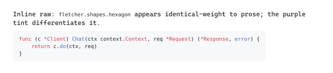
</picture>

## Whitespace and geometry

Whitespace tokens are named by the relationship they govern, not by where they appear. Geometry tokens (corner radius) sit alongside because both control how a shape feels.

### Whitespace tokens

Seven named slots cover every relationship a diagram needs. Adding ad-hoc `pt` values defeats the design system — every diagram value flows through these tokens.

<picture>
  <source media="(prefers-color-scheme: dark)" srcset="./token-inventory-dark.svg">
  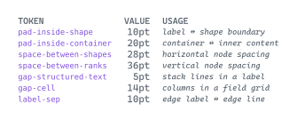
</picture>

### Shape inset

`pad-inside-shape` controls the space between label content and the shape boundary (Fletcher's `inset:` parameter). The default is 10pt; tighter reads as compact, wider reads as breathing room.

<picture>
  <source media="(prefers-color-scheme: dark)" srcset="./shape-inset-dark.svg">
  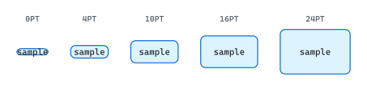
</picture>

### Corner radius

Two geometry tokens cover the typical needs: `radius-shape` (6pt) for individual entities, `radius-container` (10pt) for grouping containers. Sharp corners read as systemic / structural; soft corners read as friendly / approachable.

<picture>
  <source media="(prefers-color-scheme: dark)" srcset="./corner-radius-dark.svg">
  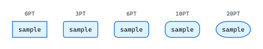
</picture>

### Stack spacing

`#stack(dir: ttb, spacing: X)` controls the gap between stacked blocks. `gap-structured-text` is the small default inside labels; `space-between-shapes` and `space-between-ranks` separate larger groups.

<picture>
  <source media="(prefers-color-scheme: dark)" srcset="./stack-spacing-dark.svg">
  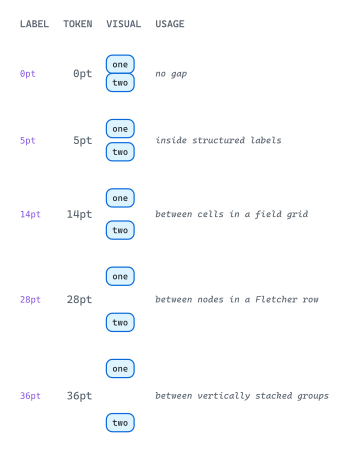
</picture>

### Grid gutters

`#grid(column-gutter: X, row-gutter: Y)` is the primary 2D layout primitive for tables and field grids. Tight gutters cluster cells visually; airy gutters separate them as discrete groups.

<picture>
  <source media="(prefers-color-scheme: dark)" srcset="./grid-gutters-dark.svg">
  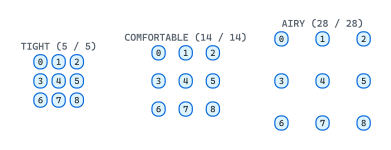
</picture>

### Fletcher diagram spacing

`diagram(spacing: (x, y))` sets the cell size of Fletcher's coordinate grid — nodes at `(0,0)` and `(1,0)` are `spacing.x` apart. Tight spacing reads as one tightly-coupled module; airy spacing reads as separate concerns.

<picture>
  <source media="(prefers-color-scheme: dark)" srcset="./fletcher-spacing-dark.svg">
  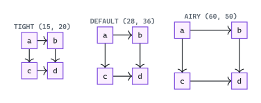
</picture>
