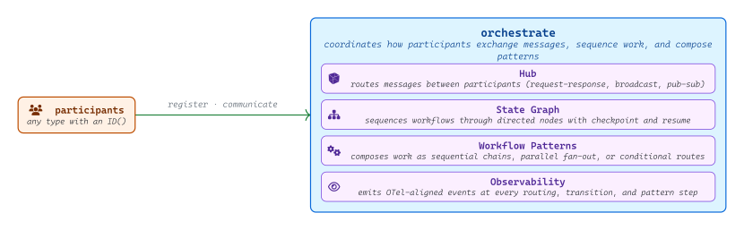
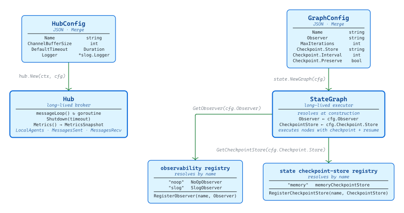
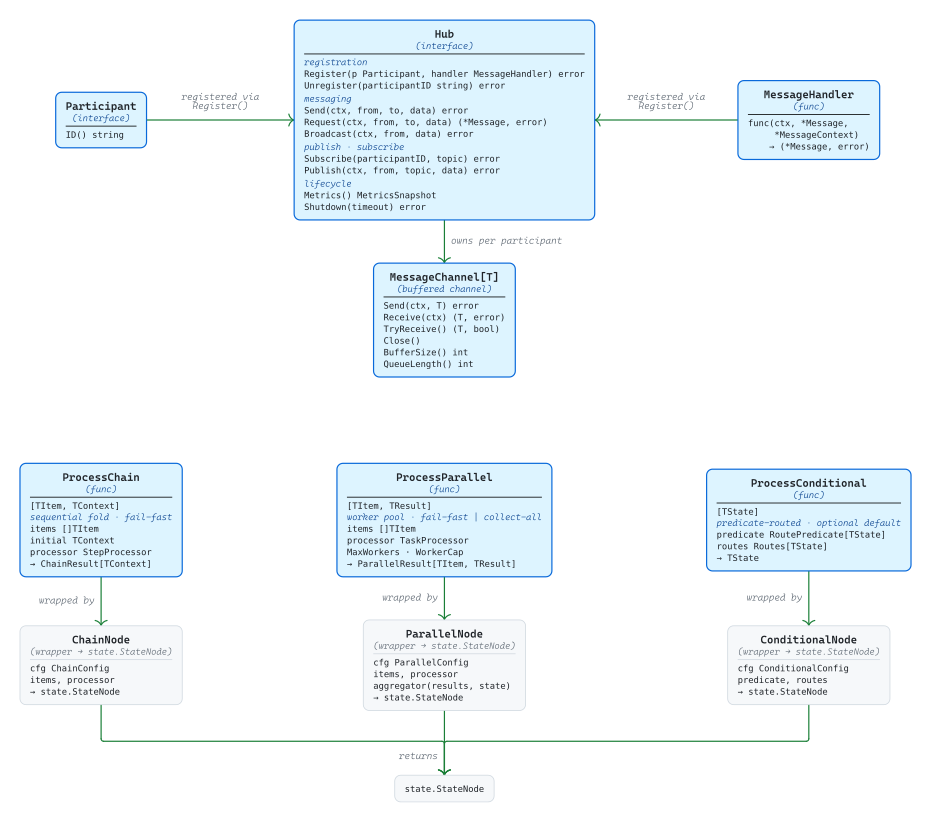
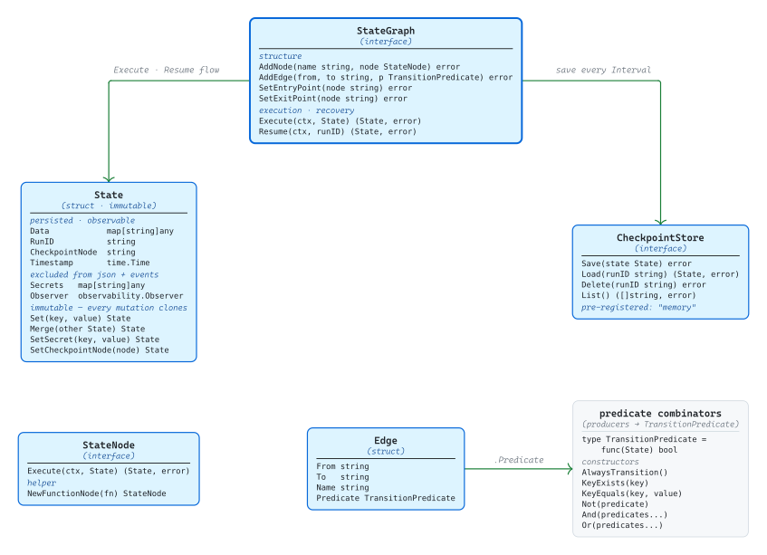

# [orchestrate](https://github.com/tailored-agentic-units/orchestrate)

Library: github.com/tailored-agentic-units/orchestrate  
Language: Go  
External dependencies:
- [google/uuid](https://github.com/google/uuid)

<picture>
  <source media="(prefers-color-scheme: dark)" srcset="./core/readme-dark.svg">
  
</picture>

Orchestrate is TAU's coordination layer: it routes messages between participants, sequences workflows through a directed state graph, and composes work as sequential, parallel, or conditional patterns — with observability emitted at every step. Anything with an identity can participate, so orchestrate works as a standalone coordination framework as well as the connective tissue between TAU agents.

## Operational

<picture>
  <source media="(prefers-color-scheme: dark)" srcset="./operational/readme-dark.svg">
  
</picture>

Hub instances are constructed from `HubConfig` (name, channel buffer size, default request timeout, `*slog.Logger`) and run a dedicated message-routing goroutine until `Shutdown(timeout)` drains in-flight work; `Metrics()` returns three atomic counters (`LocalAgents`, `MessagesSent`, `MessagesRecv`) for polling by external monitoring. State graphs are constructed from `GraphConfig` and resolve an `Observer` and a `CheckpointStore` by name from orchestrate's two global registries — `"noop"` and `"slog"` ship pre-registered in observability; `"memory"` ships pre-registered in state. Operators plug in custom durable stores or observers via `RegisterCheckpointStore(name, store)` and `RegisterObserver(name, observer)` before constructing the graph; the same observer registry is also resolved by `ChainConfig`, `ParallelConfig`, and `ConditionalConfig`, so every execution path emits OTel-aligned severity events through a uniform interface.

## Specification

<picture>
  <source media="(prefers-color-scheme: dark)" srcset="./specification/readme-dark.svg">
  
</picture>

`Hub` is the central interface: `Register(p Participant, handler MessageHandler)` admits any type satisfying `ID() string` and stores its `MessageHandler` closure alongside a per-participant `MessageChannel[*messaging.Message]` buffered to `HubConfig.ChannelBufferSize`. `Send`, `Broadcast`, `Subscribe`/`Publish` push messages through those channels; `Request` correlates responses via a UUIDv7 `ReplyTo` field and blocks until either a matching response arrives or the timeout elapses. The three workflow functions are fully generic: `ProcessChain[TItem, TContext]` folds items sequentially with state accumulation; `ProcessParallel[TItem, TResult]` fans items across an auto-sized worker pool with configurable fail-fast or collect-all-errors behavior; `ProcessConditional[TState]` evaluates a `RoutePredicate` to select a named `RouteHandler` from `Routes`, falling back to an optional `Default`. Each pattern is bridged into the state graph via `ChainNode`, `ParallelNode`, or `ConditionalNode`, which wrap the function call in `state.NewFunctionNode` to produce a value satisfying the `state.StateNode` interface — the seam between this library's composable patterns and the graph execution engine.

### State Graph

<picture>
  <source media="(prefers-color-scheme: dark)" srcset="./specification/state-graph-dark.svg">
  
</picture>

`StateGraph` defines the execution contract: nodes are added by name as `StateNode` implementations, edges connect nodes with optional `TransitionPredicate` functions (composed from `KeyExists`, `KeyEquals`, `Not`, `And`, `Or` so conditional routing is value-driven), and `Execute(ctx, initialState)` runs from the entry point through to an exit point with cycle detection and iteration-limit enforcement. `State` is immutable — every `Set`, `Merge`, or `SetCheckpointNode` call returns a new instance, preserving the original for rollback or comparison; secrets are partitioned into a separate map that is excluded from `json.Marshal` and from observer snapshots. When `CheckpointConfig.Interval > 0`, `State.Checkpoint(store)` is called every N node executions; `Resume(ctx, runID)` then loads the last saved state and re-evaluates outgoing edges from the checkpoint node to determine where to continue.
