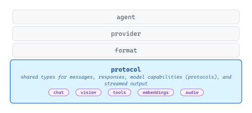
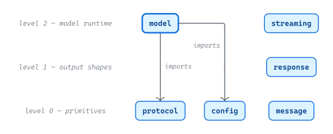
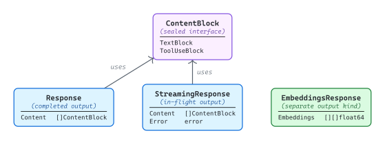

# [protocol](https://github.com/tailored-agentic-units/protocol)

Library: github.com/tailored-agentic-units/protocol  
Language: Go

<picture>
  <source media="(prefers-color-scheme: dark)" srcset="./core/readme-dark.svg">
  
</picture>

The protocol library is the foundation from which every TAU agent is built upon. It defines the shared types for messages, responses, model capabilities, and streamed output — the vocabulary every layer above speaks — so format, provider, and agent can be substituted independently.

## Specification

<picture>
  <source media="(prefers-color-scheme: dark)" srcset="./specification/readme-dark.svg">
  
</picture>

The protocol library decomposes into five packages along three conceptual levels: primitives you define before a request (`protocol` constants, `config`, `message` types), the output shapes you receive (`response`), and the runtime machinery a request needs in flight (`model`, `streaming`). The only internal coupling is `model`'s import of `protocol` and `config` — the bridge that converts string-keyed configuration to typed runtime models. The absence of `model` → `message` is deliberate: the bridge is capability + configuration only, not conversation. The other four packages are independent and importable à la carte.

### Response Structures

<picture>
  <source media="(prefers-color-scheme: dark)" srcset="./specification/response-shapes-dark.svg">
  
</picture>

The response architecture is a small discriminated union: `Response` includes `Content: []ContentBlock`. `ContentBlock` is a sealed interface, with `TextBlock` and `ToolUseBlock` being the only implementations. `StreamingResponse` mirrors `Response` for in-flight delivery, plus an `Error` field because streams can fail mid-flight. `EmbeddingsResponse` is structurally separate: embeddings are an entirely different output kind, not a third `ContentBlock` variant.

Additionally, tool-call encoding is **asymmetric**: `ToolFunction.Arguments` is a `string` on the request side (matching what models emit), and `ToolUseBlock.Input` is `map[string]any` on the response side (after parsing). Streaming is a **per-capability** property: `Protocol.SupportsStreaming()` returns `true` for `Chat`/`Vision`/`Tools`, and `false` for `Embeddings`/`Audio`.

