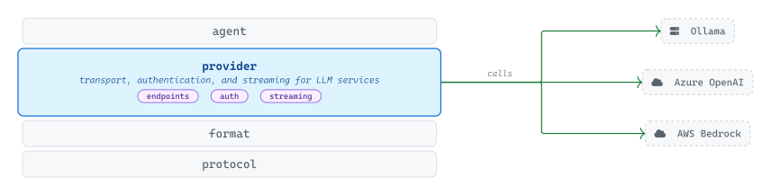
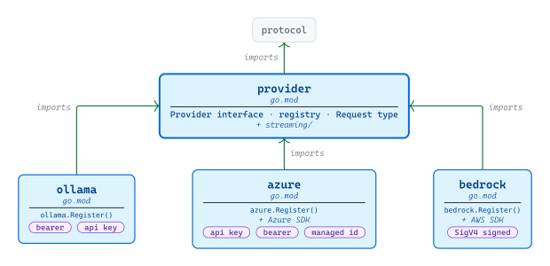
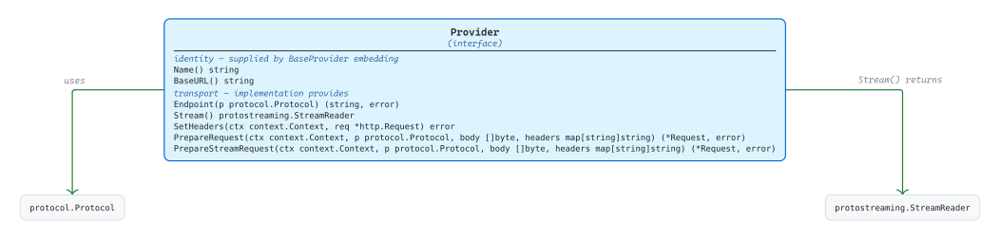
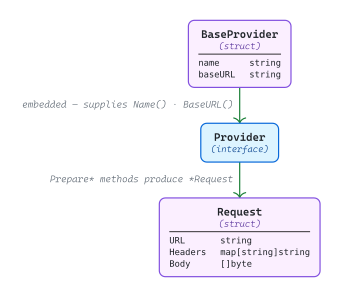
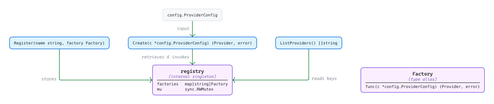

# [provider](https://github.com/tailored-agentic-units/provider)

Library: github.com/tailored-agentic-units/provider  
Language: Go  
Native dependencies:
- [protocol](../protocol/)

<picture>
  <source media="(prefers-color-scheme: dark)" srcset="./core/readme-dark.svg">
  
</picture>

The provider library is TAU's transport boundary to LLM services: it handles endpoint construction, authentication, and streaming so the application above never learns the difference between a self-hosted Ollama runtime, Azure OpenAI Service, or AWS Bedrock. Adding a new service means adding a new sub-module — no changes propagate to the agent, format, or protocol layers above.

## Operational

<picture>
  <source media="(prefers-color-scheme: dark)" srcset="./operational/readme-dark.svg">
  
</picture>

Each sub-module (`ollama`, `azure`, `bedrock`) ships its own `go.mod`, isolating cloud-SDK weight so binaries only carry what they register. The root module and its `streaming/` sub-package depend solely on `protocol`; Azure and Bedrock pull in their respective SDKs only inside their own sub-modules. Registration is explicit — a caller invokes `Register()` on each desired sub-module before calling `provider.Create(c)` — keeping side effects visible and `init()`-free.

## Specification

<picture>
  <source media="(prefers-color-scheme: dark)" srcset="./specification/readme-dark.svg">
  
</picture>

`Provider` is a seven-method interface every implementation satisfies. Two methods (`Name()`, `BaseURL()`) are the identity accessors that `BaseProvider` supplies via embedding; the remaining five (`Endpoint`, `Stream`, `SetHeaders`, `PrepareRequest`, `PrepareStreamRequest`) are the transport methods each implementation provides. Method signatures cross into `protocol.Protocol` (the capability discriminator) and `protostreaming.StreamReader` from the protocol library — both referenced, neither re-exported.

### Types

<picture>
  <source media="(prefers-color-scheme: dark)" srcset="./specification/types-dark.svg">
  
</picture>

`BaseProvider` is the partial-implementation helper concrete providers embed to inherit `Name()` and `BaseURL()` along with their underlying `name` and `baseURL` fields. `Request` is the prepared output of both `PrepareRequest` and `PrepareStreamRequest` — a decoupled structure carrying the resolved URL, merged headers, and pre-marshaled body so the HTTP client layer executes without knowing the provider.

### Registry

<picture>
  <source media="(prefers-color-scheme: dark)" srcset="./specification/registry-dark.svg">
  
</picture>

A package-level `*registry` singleton guards a `name → Factory` map with a `sync.RWMutex`. `Register` writes a factory under a name; `Create` reads the factory keyed by `ProviderConfig.Name` and invokes it with the same `*config.ProviderConfig`; `ListProviders` enumerates registered names. `Factory` is typed as `func(c *config.ProviderConfig) (Provider, error)` — the constructor each sub-module supplies at registration time.

## Implementations

- [ollama](./ollama/) — local and remote Ollama runtimes via the OpenAI-compatible API
- [azure](./azure/) — Azure OpenAI Service with deployment-based routing and API key, bearer, or managed-identity auth
- [bedrock](./bedrock/) — AWS Bedrock via the Converse API with SigV4-signed requests
