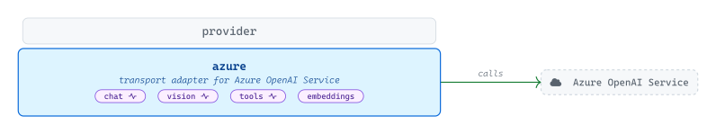
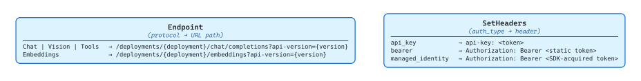
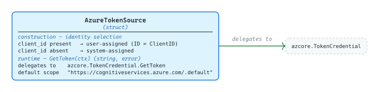

# [azure](https://github.com/tailored-agentic-units/provider/tree/main/azure)

Library: github.com/tailored-agentic-units/provider/azure  
Language: Go  
Native dependencies:
- [provider](../)
- [protocol](../../protocol/)

External dependencies:
- [azure-sdk-for-go](https://github.com/Azure/azure-sdk-for-go)

<picture>
  <source media="(prefers-color-scheme: dark)" srcset="./core/readme-dark.svg">
  
</picture>

The `azure` sub-module connects any TAU application to Azure OpenAI Service, covering chat, vision, tool use, and embeddings, with SSE streaming on the first three. It handles deployment-based URL routing and all three Azure authentication modes — static API key, static bearer token, and dynamic managed identity — with token acquisition for managed identity backed by the Azure SDK.

## Specification

<picture>
  <source media="(prefers-color-scheme: dark)" srcset="./specification/readme-dark.svg">
  
</picture>

`AzureProvider` embeds `*provider.BaseProvider` and adds deployment-keyed dispatch. `Endpoint` constructs every URL as `{BaseURL}/deployments/{deployment}/{path}?api-version={version}`, collapsing `Chat`, `Vision`, and `Tools` onto `/chat/completions` and routing `Embeddings` to `/embeddings`. The `deployment` and `api_version` options are required at construction time, so `Endpoint` never has to fall back or re-validate. `SetHeaders` branches on `auth_type`: `api_key` sets the `api-key` header directly with the static token; `bearer` sets `Authorization: Bearer` with the static token from options; `managed_identity` calls `AzureTokenSource.GetToken` at request time and sets `Authorization: Bearer` with the SDK-acquired token.

### Token Source

<picture>
  <source media="(prefers-color-scheme: dark)" srcset="./specification/token-source-dark.svg">
  
</picture>

`AzureTokenSource` is a thin wrapper around `azidentity.ManagedIdentityCredential`. Construction selects the identity flavor — when `client_id` is provided in options, it sets `ManagedIdentityCredentialOptions.ID = ClientID` for user-assigned identity; otherwise system-assigned identity is used. `GetToken(ctx)` requests a token for the configured scope (defaulting to `https://cognitiveservices.azure.com/.default` when none is supplied) and returns the raw token string; the Azure SDK handles caching and expiry refresh internally, so no token state is held in `AzureTokenSource` itself.
