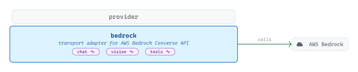
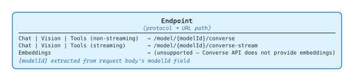
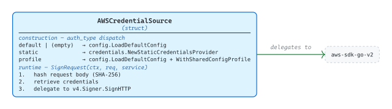
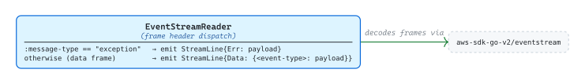

# [bedrock](https://github.com/tailored-agentic-units/provider/tree/main/bedrock)

Library: github.com/tailored-agentic-units/provider/bedrock  
Language: Go  
Native dependencies:
- [provider](../)
- [protocol](../../protocol/)

External dependencies:
- [aws-sdk-go-v2](https://github.com/aws/aws-sdk-go-v2)

<picture>
  <source media="(prefers-color-scheme: dark)" srcset="./core/readme-dark.svg">
  
</picture>

The `bedrock` sub-module connects any TAU application to AWS-hosted foundation models through the Bedrock Converse API, covering chat, vision, and tool use with SSE-style streaming on all three. Credentials are resolved at construction time across three AWS auth strategies, and every outbound request is signed with SigV4. Embeddings are not available through the Converse API and return an unsupported error.

## Specification

<picture>
  <source media="(prefers-color-scheme: dark)" srcset="./specification/readme-dark.svg">
  
</picture>

`BedrockProvider` embeds `*provider.BaseProvider` and routes every supported protocol to `/model/{modelId}/converse` for non-streaming requests and `/model/{modelId}/converse-stream` for streaming. `Endpoint` returns the path template with the `{modelId}` placeholder; `PrepareRequest` and `PrepareStreamRequest` extract the model ID from the request body's `modelId` field and substitute it at call time. `SetHeaders` is intentionally minimal — it delegates unconditionally to `AWSCredentialSource.SignRequest`, so SigV4 signing applies to every outbound request without any per-request branching.

### Credentials

<picture>
  <source media="(prefers-color-scheme: dark)" srcset="./specification/credentials-dark.svg">
  
</picture>

`AWSCredentialSource` resolves credentials once at construction. The `default` and `profile` branches load through `aws-sdk-go-v2/config.LoadDefaultConfig` (with `WithSharedConfigProfile` for the profile case); the `static` branch constructs a `credentials.StaticCredentialsProvider` directly from the `access_key_id`, `secret_access_key`, and optional `session_token` options. At request time, `SignRequest` reads the request body to compute a SHA-256 payload hash, retrieves credentials from whichever provider was selected, and calls `v4.Signer.SignHTTP` with the hash, service, and region — credential caching, refresh, and the SigV4 algorithm itself live inside the AWS SDK.

### Event Stream

<picture>
  <source media="(prefers-color-scheme: dark)" srcset="./specification/eventstream-dark.svg">
  
</picture>

`EventStreamReader` implements `protocol/streaming.StreamReader` for Bedrock's binary event-stream format, replacing the SSE reader the other provider sub-modules use. It iterates `eventstream.Decoder.Decode` from `aws-sdk-go-v2`, inspects each frame's `:message-type` and `:event-type` headers, and dispatches: `exception` frames become `StreamLine{Err: …}` and end the stream; other frames are re-emitted as `StreamLine{Data: {<event-type>: payload}}` JSON envelopes — letting the format-layer parser consume Bedrock's binary frames without learning the wire encoding.
