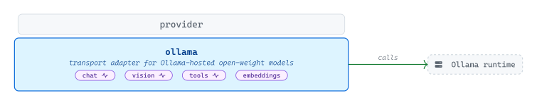
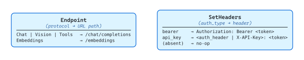

# [ollama](https://github.com/tailored-agentic-units/provider/tree/main/ollama)

Library: github.com/tailored-agentic-units/provider/ollama  
Language: Go  
Native dependencies:
- [provider](../)
- [protocol](../../protocol/)

<picture>
  <source media="(prefers-color-scheme: dark)" srcset="./core/readme-dark.svg">
  
</picture>

The `ollama` sub-module connects any TAU application to Ollama-hosted open-weight models — local or remote — covering chat, vision, tool use, and embeddings, with streaming on the first three. It speaks Ollama's OpenAI-compatible API path and adds optional bearer or API-key authentication; no external SDK is required.

## Specification

<picture>
  <source media="(prefers-color-scheme: dark)" srcset="./specification/readme-dark.svg">
  
</picture>

`OllamaProvider` embeds `*provider.BaseProvider` to inherit `Name()` and `BaseURL()` and adds the dispatch behaviors above. `Endpoint` collapses three conversational protocols (`Chat`, `Vision`, `Tools`) onto `/chat/completions` because Ollama's OpenAI-compatible surface accepts the same path for all three; `Embeddings` resolves to `/embeddings`. `SetHeaders` is a conditional no-op — it reads `auth_type` and `token` from the options map and sets the matching header only when both are present, falling through silently for unauthenticated local instances. `NewOllama` normalizes the configured base URL at construction time, defaulting to `http://localhost:11434` and appending `/v1` if the suffix is missing, so the dispatch table never has to re-resolve the prefix.
