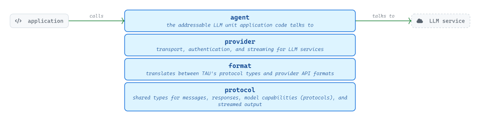
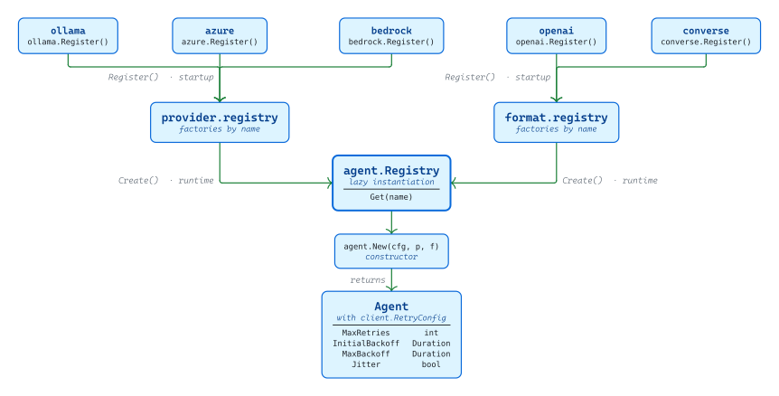
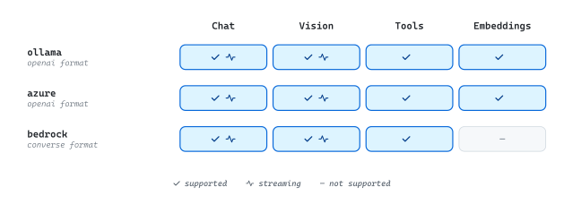
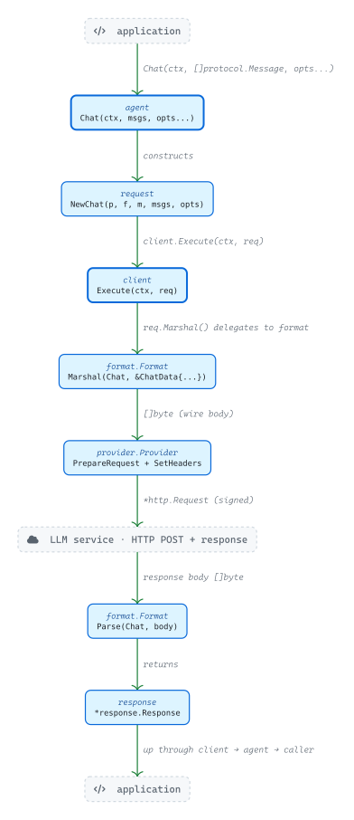
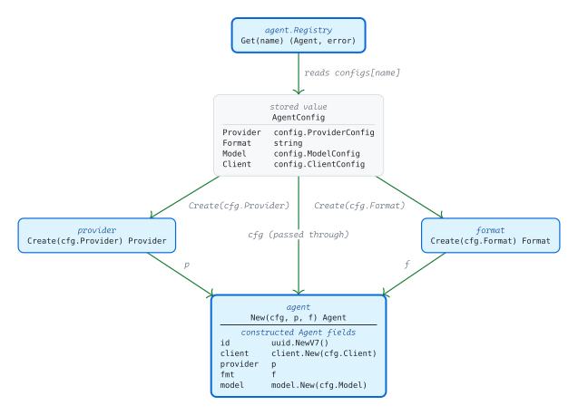

# [tau](https://github.com/tailored-agentic-units)

Platform: github.com/tailored-agentic-units  
Language: Go  
Components:
- [protocol](../protocol/)
- [format](../format/)
- [provider](../provider/)
- [agent](../agent/)

<picture>
  <source media="(prefers-color-scheme: dark)" srcset="./core/readme-dark.svg">
  
</picture>

TAU is a four-library Go runtime for building and operating addressable LLM agents. A named agent translates application messages into the wire format an LLM service expects, sends them over the right transport, and returns a typed response — regardless of whether the service is a local Ollama instance, Azure OpenAI, or AWS Bedrock. Swapping one LLM service for another means changing configuration, not application code.

## Operational

<picture>
  <source media="(prefers-color-scheme: dark)" srcset="./operational/readme-dark.svg">
  
</picture>

Before any request can execute, each sub-module the application intends to use must call its `Register()` function at startup — writing a factory into the `provider.registry` or `format.registry` global singleton. At runtime, `agent.Registry.Get(name)` reads the stored `AgentConfig`, resolves `provider.Create(cfg.Provider)` and `format.Create(cfg.Format)` from those registries, and constructs an `Agent` instance lazily on first access; subsequent `Get` calls return the cached instance. Each constructed agent carries an HTTP client whose retry policy — `MaxRetries`, `InitialBackoff`, `MaxBackoff`, `Jitter` — is the operator's primary tuning surface, applied on transient HTTP 429 / 502 / 503 / 504 and network errors.

### Capabilities

<picture>
  <source media="(prefers-color-scheme: dark)" srcset="./operational/provider-format-matrix-dark.svg">
  
</picture>

Two provider implementations pair with the `openai` format sub-module — `ollama` and `azure` — and share the same protocol surface: `Chat`, `Vision`, `Tools`, `Embeddings`, with streaming on chat and vision. The `bedrock` provider pairs with the `converse` format sub-module and covers `Chat`, `Vision`, and `Tools` with streaming, but the AWS Bedrock Converse API does not expose an embeddings endpoint. Streaming is delivered through Go channels at the agent layer via `ChatStream` and `VisionStream`.

## Specification

<picture>
  <source media="(prefers-color-scheme: dark)" srcset="./specification/readme-dark.svg">
  
</picture>

A `Chat` call traverses every TAU library on its way to the LLM service. `agent.Chat` merges `model.Options[protocol.Chat]` with the request-time `opts...`, then calls `request.NewChat(provider, format, model, messages, options)` to bundle the inputs into a typed `ChatRequest`. `client.Execute(ctx, req)` wraps the next four steps in `doWithRetry`: `req.Marshal()` delegates to `format.Format.Marshal(protocol.Chat, &format.ChatData{...})` to produce the wire body; `provider.PrepareRequest` builds an `*http.Request` (URL + body + base headers); `provider.SetHeaders` applies the configured auth (bearer / api-key / SigV4); `client.HTTPClient().Do` dispatches the POST. The response body bytes flow back to `format.Format.Parse(protocol.Chat, body)`, which produces a `*response.Response` that surfaces up through `client.Execute` and `agent.Chat` to the caller. The streaming variant forks at `client.ExecuteStream`: `provider.PrepareStreamRequest` adds SSE headers, `provider.Stream().ReadStream` emits `StreamLine` values on a channel, and `format.ParseStreamChunk` converts each line into a `*response.StreamingResponse` delivered on a `<-chan` to the caller.

### Registry Composition

<picture>
  <source media="(prefers-color-scheme: dark)" srcset="./specification/registry-composition-dark.svg">
  
</picture>

`agent.Registry.Get(name)` is the sole point in TAU where all four libraries converge to construct an `Agent`. The stored `AgentConfig` carries one configuration value per library — `Provider` (a `config.ProviderConfig`), `Format` (the registered format name as a `string`), `Model` (a `config.ModelConfig`), and `Client` (a `config.ClientConfig`). `provider.Create(cfg.Provider)` reads the registered factory by name from `provider.registry` and invokes it to produce a `provider.Provider` instance; `format.Create(cfg.Format)` does the same against `format.registry` to produce a `format.Format` instance. Both resolved values, alongside the original `cfg`, flow into `agent.New(cfg, p, f)`, which mints a UUIDv7 identity, wraps a new `client.Client` built from `cfg.Client`, and constructs a `model.Model` from `cfg.Model` — five composed fields that together define an addressable agent. The result is cached in `agents[name]` so subsequent `Get(name)` calls bypass the entire construction path.
